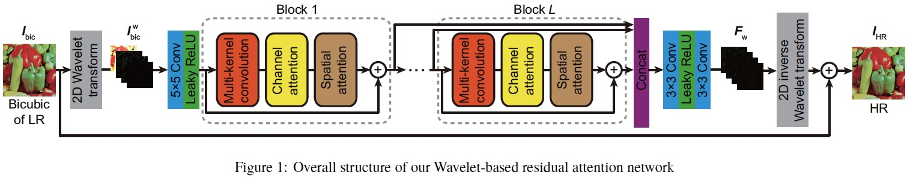
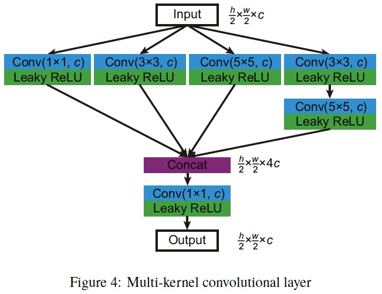
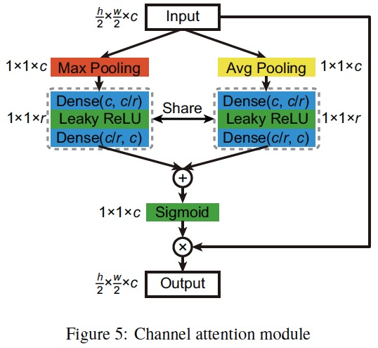
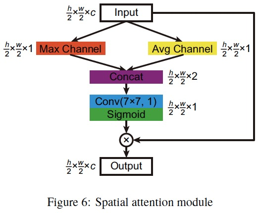

# WRANSR-keras

This project is the implementation of paper "Xue S. et al., Wavelet-based Residual Attention Network for Image Super-Resolution, Neurocomputing, 2019".











# Environment
- OS: CentOS 7 Linux kernel 3.10.0-514.el7.x86_64
- CPU: Intel Xeon(R) CPU E5-2667 v4 @ 3.20GHz x 32
- Memory: 251.4 GB
- GPU: NVIDIA Tesla P4, 8 GB

# Software
- Python 2.7.14
- Tensorflow 1.13
- Keras 


# Dataset
These datasets are the same as other paper provided. Readers can directly use them or download them from here:

[BSDS100](https://drive.google.com/open?id=13yF988p3SfFEFsBxe6fqbmm7pHaCAndY), 
[BSDS200](https://drive.google.com/open?id=1DH-LWAtmoTC58STZ6wnp-wiNJdtn__D8), 
[General-100](https://drive.google.com/open?id=1ZZbVnycyu6rG3_Lfd4zEqyFTSGYeWIru), 
[Set5](https://drive.google.com/open?id=1VqTnAaMOwaHwlUtf1-JodObHJx5efLAC), 
[Set14](https://drive.google.com/open?id=17iz-E2m-9DuXRs7JnP6BUKUdCa_L1B-e), 
[T91](https://drive.google.com/open?id=1Q_7dDC6tfzzlygcmo_nSWEH_s8VMysdT), 
[Train_291](https://drive.google.com/open?id=1diz4wIG722KKwb9U3TLxHSKJ4oI2PclV), 
[Urban100](https://drive.google.com/open?id=1xjD8Rj_8werEkNQuXKdNcrF9VWz6wp7l), and 
[DIV2K](https://data.vision.ee.ethz.ch/cvl/DIV2K/).

# Train

``` python
python main.py
```

# Parameters for training
- scale = 2/3/4
- depth = 8
- ratio = 4
- width = 64
- alpha = 0.1
- batch_size = 64
- epochs = 200

# Test

``` python
python predict.py
```

# Contact
Ph.D. candidate, Shengke Xue

College of Information Science and Electronic Engineering

Zhejiang University, Hangzhou, P.R. China

Email: xueshengke@zju.edu.cn, xueshengke1993@gmail.com
